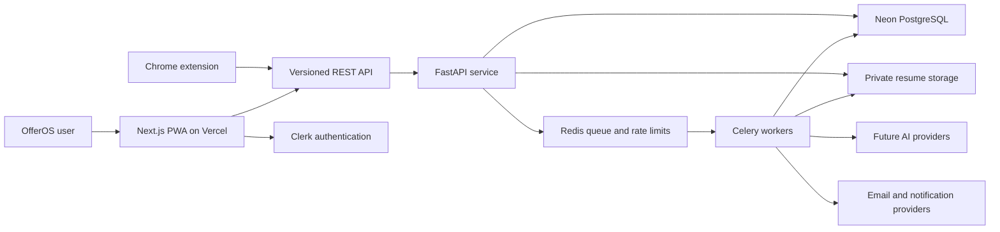
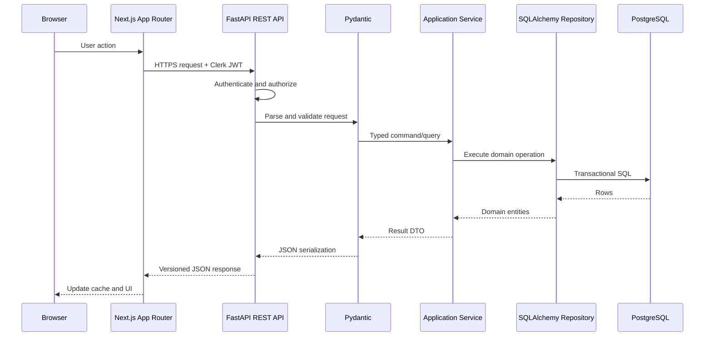
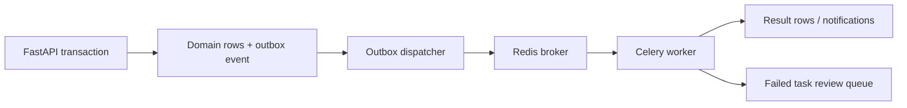
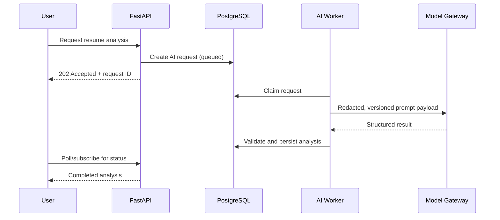

# OfferOS Production Architecture

## Status and Scope

This document defines the target production architecture for OfferOS. It is a design contract for the backend phase; it does not imply that the backend, authentication, cloud storage, queues, or AI features exist today.

OfferOS should begin as a **modular monolith**: one Next.js application, one FastAPI service, and one PostgreSQL database. Internal boundaries must be strong enough that high-load concerns can be extracted later, but deployment complexity should not be introduced before usage requires it.

## Architecture Principles

1. **REST-first contracts.** The browser, future Chrome extension, and future integrations consume the same versioned API.
2. **Server is authoritative.** PostgreSQL becomes the source of truth after cloud migration; local browser state becomes a cache and offline queue.
3. **Thin transport layers.** Route handlers authenticate, validate, call application services, and serialize responses. They do not contain business rules.
4. **Domain-oriented modules.** Applications, resumes, prep, analytics, notifications, imports, and AI each own their use cases and persistence interfaces.
5. **Asynchronous by necessity.** File extraction, AI analysis, email delivery, analytics rollups, and extension imports run outside request latency.
6. **Observable operations.** Every request and job receives a correlation ID; failures are measurable and actionable.
7. **Incremental migration.** Existing frontend types and storage helpers should be replaced behind repositories rather than rewriting UI components.

## System Context



## Request Lifecycle

The required synchronous path is:



### Layer Responsibilities

| Layer | Responsibilities | Must not do |
| --- | --- | --- |
| Browser/PWA | Rendering, interaction, optimistic state, offline queue, accessibility | Trust local data for authorization or billing decisions |
| Next.js App Router | Routes, layouts, server-rendered shell, API client composition, Clerk UI integration | Duplicate backend business rules |
| REST API | Stable `/v1` resource contract, HTTP semantics, pagination, idempotency | Reach directly into UI state |
| FastAPI transport | Authentication dependency, request context, route wiring, status codes | Implement workflows in route functions |
| Pydantic schemas | Input validation, output projection, contract documentation | Act as ORM models or mutate database state |
| Application services | Use-case orchestration, authorization policy calls, transaction boundaries | Depend on FastAPI request objects |
| Domain modules | Business invariants, state transitions, value objects | Depend on infrastructure libraries |
| SQLAlchemy repositories | Query composition, persistence mapping, row locking | Decide product policy |
| PostgreSQL | Durable state, relational integrity, constraints, transactional consistency | Store uploaded file bytes |
| Workers | Extraction, AI, notifications, imports, rollups, retries | Serve interactive HTTP traffic |

## Backend Module Shape

The future backend should be organized by domain, with shared infrastructure kept small:

```text
apps/api/
  app/
    main.py
    core/                 # configuration, logging, security, errors
    db/                   # engine, session, migrations, base models
    modules/
      users/
      applications/
      resumes/
      prep/
      analytics/
      notifications/
      saved_jobs/
      imports/
      ai/
    workers/              # Celery entry points and task adapters
    integrations/         # Clerk, storage, email, AI provider adapters
  tests/
```

Each domain module contains transport routes, Pydantic schemas, application services, domain policies, and repository implementations. Cross-module access occurs through explicit service interfaces, not imports of another module's ORM tables from route code.

## Frontend Data Architecture

The current localStorage modules are useful migration boundaries. Production should introduce domain repositories with two implementations:

```text
ApplicationRepository
  LocalApplicationRepository   # current local-only mode and migration source
  ApiApplicationRepository     # authenticated cloud mode
```

The same pattern applies to resumes and prep. UI components consume hooks/services, not localStorage or `fetch` directly. A one-time migration flow can upload local records after sign-in, preserving client-generated IDs as idempotency keys.

Recommended client data behavior:

- Use server-rendered shells for routes and client queries for mutable user data.
- Use a query cache such as SWR when the backend phase begins; do not add it before needed.
- Maintain an IndexedDB-backed offline mutation queue for the PWA; localStorage is not reliable for transactional queues.
- Attach `client_mutation_id` to offline writes so retries are idempotent.
- Resolve conflicts using `updated_at` plus an explicit version number, not silent last-write-wins for every resource.

## Transaction and Consistency Model

- One application-service command owns one database transaction.
- Business writes and outbox events commit atomically.
- External calls never occur while a database transaction is open.
- Read-after-write consistency is expected for primary CRUD.
- Analytics snapshots, notifications, extraction, and AI results are eventually consistent.
- Optimistic concurrency uses an integer `version` or `If-Match` ETag on frequently edited resources.

## Background Jobs and Event Flow



Use a transactional outbox table so a committed domain change cannot lose its corresponding asynchronous work. Workers must be idempotent, retry with exponential backoff and jitter, and record terminal failure metadata. Jobs should expose status through resource endpoints rather than holding HTTP connections open.

Initial job classes:

- Resume virus scan and text extraction
- Resume analysis and job matching
- Analytics snapshot generation
- Notification delivery
- Chrome extension import normalization
- Calendar/email synchronization
- Data export and account deletion

## Notification Architecture

Notifications are domain events transformed into delivery requests:

1. A service records an event such as `application.deadline_approaching`.
2. The outbox dispatcher publishes it.
3. A notification policy loads user preferences and quiet hours.
4. A worker creates an in-app notification and optionally sends email/push.
5. Delivery attempts are recorded with provider response IDs.

The notification module owns templates, preferences, scheduling, deduplication keys, and delivery status. Product modules emit semantic events but do not call email providers directly.

## Future AI Integration

AI is an asynchronous bounded context, not a helper imported into normal CRUD services.



Requirements:

- Store prompt template version, model, provider, latency, token usage, cost, and status.
- Validate model output against Pydantic schemas before persistence.
- Redact unnecessary personal data and never use user documents for training without explicit consent.
- Keep provider adapters behind a model gateway so providers can change without domain rewrites.
- Rate-limit by user and feature; enforce budget caps server-side.
- Treat AI output as advisory and retain the source resume/job version used for reproducibility.

## Chrome Extension Integration

The extension is a separate OAuth/JWT client of the same REST API. It submits saved jobs to `/v1/extension/imports` with source URL, parsed fields, parser version, and a client-generated idempotency key. The API stores the immutable import payload, normalizes it asynchronously, and creates or updates a `saved_job`. Users explicitly promote saved jobs into applications.

Site-specific parsers for LinkedIn, Greenhouse, Lever, Ashby, and Workday live in the extension. The backend owns validation, deduplication, canonical company matching, and audit history. Parser failures must not corrupt existing applications.

## Scalability Strategy

Scale in this order:

1. Add database indexes based on measured query plans.
2. Scale FastAPI replicas horizontally; keep processes stateless.
3. Use Neon's pooled connections and bound SQLAlchemy pool sizes.
4. Move expensive work to workers and scale worker queues independently.
5. Cache only expensive, stable reads; invalidate by domain event.
6. Partition high-volume append-only tables such as analytics events or AI requests when measured volume justifies it.
7. Extract a service only when a domain needs independent scaling, ownership, or availability.

Likely extraction candidates are AI processing and notification delivery. Applications, resumes, and prep should remain together until there is evidence that separation improves operations.

## Reliability and Observability

- Structured JSON logs with `request_id`, `user_id`, route, status, and latency.
- Sentry tracing across Next.js, FastAPI, and workers.
- Health endpoints separate liveness from database readiness.
- Metrics for API latency, error rate, queue depth, job age, database saturation, and AI spend.
- Audit records for security-sensitive changes and support actions.
- Daily backups and tested point-in-time recovery.
- Runbooks for provider outage, queue backlog, migration failure, and data restoration.

## Testing Strategy

| Scope | Test type |
| --- | --- |
| Domain policies | Fast unit tests without database or framework |
| Application services | Unit tests with repository fakes |
| Repositories | PostgreSQL integration tests |
| API contracts | FastAPI tests generated from OpenAPI examples |
| Frontend repositories | Contract tests against mocked API responses |
| Critical workflows | Browser end-to-end tests |
| Workers | Idempotency, retry, and malformed-provider-response tests |

## Key Decisions

- **Modular monolith first:** maximizes cohesion and transaction safety while minimizing operational overhead.
- **REST over GraphQL:** resource workflows are predictable, extension clients are simple, and OpenAPI provides typed contracts.
- **PostgreSQL over document storage:** the domain is relational and requires ownership, constraints, reporting, and joins.
- **Pydantic separate from SQLAlchemy:** API compatibility and persistence evolution remain independent.
- **Outbox before event bus:** reliable asynchronous behavior without operating a distributed event platform prematurely.
- **Private object storage for files:** database rows retain metadata and references, not resume bytes.
