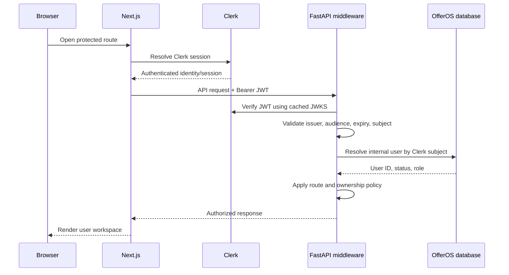

# OfferOS Authentication and Authorization

## Decision

OfferOS will use **Clerk** as the identity provider for Google, GitHub, and email authentication. Clerk owns credential handling, OAuth exchanges, session cookies, account recovery, and identity verification. FastAPI remains authoritative for OfferOS user records, product roles, resource ownership, and feature authorization.

No backend or authentication is implemented by this document.

## Authentication Flow

## Supported Sign-In Methods

- Google OAuth
- GitHub OAuth
- Email address with Clerk-supported verification (magic link or code preferred over password storage in OfferOS)

Provider accounts linked by Clerk map to one Clerk user subject. OfferOS must never create separate product accounts based only on matching unverified email addresses.

## Next.js Responsibilities

- Use Clerk's App Router integration for middleware/proxy and server-side session resolution.
- Protect authenticated route groups and redirect signed-out users to sign-in.
- Obtain short-lived API tokens using a dedicated Clerk JWT template/audience for FastAPI.
- Render authorization-aware navigation as UX only; backend checks remain mandatory.
- Never expose Clerk secret keys to Client Components.
- Clear user-specific query caches and offline mutation queues on sign-out.

Recommended route classes:

| Route class | Examples | Access |
| --- | --- | --- |
| Public | Landing/sign-in, privacy, terms, PWA assets | Anonymous |
| Authenticated | Dashboard, applications, resumes, prep, analytics, settings | Active user |
| Onboarding | Profile bootstrap | Authenticated, incomplete profile allowed |
| Operations | Support/admin tooling | Explicit product role |

Next.js route protection is not a security boundary by itself. Every FastAPI request is independently authenticated and authorized.

## JWT Validation in FastAPI

A FastAPI authentication dependency/middleware performs:

1. Parse `Authorization: Bearer` header.
2. Decode only algorithms explicitly allowed by Clerk configuration.
3. Select the public key by `kid` from Clerk JWKS.
4. Validate signature, issuer, audience, expiry, not-before, and subject.
5. Validate authorized party/client ID where Clerk configuration requires it.
6. Resolve `sub` to `users.clerk_user_id`.
7. Reject suspended, deletion-pending, or deleted users as policy requires.
8. Attach an immutable request principal containing internal user ID, Clerk subject, role, session ID, and request ID.

JWKS keys are cached with bounded TTL and refreshed on unknown `kid`. A key-refresh failure must not disable signature verification. Tokens are never accepted from query parameters.

## User Provisioning and Synchronization

Clerk webhooks synchronize identity lifecycle:

- `user.created`: idempotently create the OfferOS user, profile, and settings defaults.
- `user.updated`: update verified primary email and safe display metadata.
- `user.deleted`: mark deletion pending and enqueue the retention/privacy workflow.

Webhook processing requirements:

- Verify Clerk/Svix signature against the raw request body.
- Enforce timestamp/replay tolerance.
- Persist webhook event ID and reject duplicate processing.
- Return quickly after durable acceptance; heavy cleanup runs asynchronously.
- Reconcile on first authenticated request if a webhook is delayed.

The first API request may idempotently bootstrap a missing user from validated token claims, but webhooks remain the full lifecycle source.

## Authorization Model

### Roles

| Role | Scope |
| --- | --- |
| `user` | Own product data and permitted integrations |
| `support` | Limited audited support views; no arbitrary document access by default |
| `admin` | Operational configuration and approved moderation actions |

Roles live in the OfferOS database, not editable Clerk public metadata. Clerk may carry a role hint for UI rendering, but FastAPI reloads authoritative roles for sensitive operations.

### Resource Ownership

Authorization is ownership-first:

- Every user-owned root entity has `user_id` or a required path to one.
- Repository methods require `principal.user_id`; unscoped `get(id)` methods are prohibited in request paths.
- Child resources validate ownership through the parent.
- Cross-user sharing is not supported until a deliberate workspace/membership model is designed.
- Non-owned resources return `404` to reduce enumeration.

Policy examples:

- A user can modify an application only when `application.user_id == principal.user_id`.
- A resume analysis requires ownership of the resume version and optional target application.
- An extension import must match the authenticated user and registered installation.
- Support access requires a ticket/reason, short-lived elevation, and audit event.

## Session Handling

- Clerk session cookies remain `HttpOnly`, `Secure`, and `SameSite=Lax` or stricter where compatible.
- API JWTs are short-lived and held in memory, not localStorage.
- The frontend refreshes tokens through Clerk before expiry.
- FastAPI does not maintain a duplicate server session for ordinary requests.
- High-risk actions such as account deletion, changing primary identity, or exporting sensitive data require recent authentication.
- Sign-out revokes the Clerk session and clears local user-specific caches.

Offline PWA mutations may be queued locally, but replay requires a fresh valid token. The queue must be partitioned by Clerk user ID and never replay one user's changes into another session.

## API Security

### CORS and CSRF

- Allow only production OfferOS origins, preview-origin policy, and explicit local development origins.
- Bearer-token API requests do not rely on cross-site cookies, reducing CSRF exposure.
- Clerk/Next.js cookie-backed endpoints use Clerk's recommended CSRF protections.
- Never use wildcard origins with credentials.

### Rate Limiting

Use layered limits:

| Class | Example policy |
| --- | --- |
| Read CRUD | Per user, generous burst and sustained limits |
| Write CRUD | Per user and IP risk signal |
| Auth/webhook | Provider signature plus IP/volume anomaly monitoring |
| Upload intents | Tight per-user daily and concurrent limits |
| AI | Per-user feature quota, concurrency limit, and cost budget |
| Extension imports | Per installation and user, idempotent retries excluded |

Redis-backed token buckets are appropriate once multiple API replicas are deployed. Return `429` with `Retry-After` and stable error codes.

### Data and Token Hygiene

- Never log bearer tokens, cookies, authorization headers, raw resumes, or STAR story content.
- Redact email, URLs with secrets, and provider payloads from errors.
- Use TLS for every environment outside isolated local development.
- Rotate Clerk and webhook secrets; maintain separate keys per environment.
- Use least-privilege service credentials for database, storage, Sentry, and analytics.
- Store resume objects privately and issue short-lived signed URLs only after authorization.

## Public and Protected API Routes

Public:

- `GET /health/live`
- `GET /health/ready` (minimal dependency state, no secrets)
- `GET /version`
- `POST /internal/clerk/webhooks` (signature-protected, not anonymous-trusted)

Protected:

- All `/api/v1/users/me`, profile, application, resume, prep, analytics, notification, setting, saved-job, extension, and AI routes.

Operational routes should be on a separate hostname or network policy where possible, require an OfferOS admin role, and generate audit events.

## Clerk Configuration

Maintain separate Clerk instances or environment configurations for development, preview/staging, and production. Configure:

- Allowed redirect and sign-out URLs.
- Google and GitHub OAuth credentials per environment.
- Email verification policy.
- JWT template with stable issuer/audience for FastAPI.
- Webhook endpoint and signing secret.
- Session lifetime and inactivity timeout.
- Bot/abuse protections supported by Clerk.

Production must reject development issuers and audiences.

## Failure Modes

| Failure | Behavior |
| --- | --- |
| Clerk unavailable during new sign-in | Show retryable auth error; existing valid JWTs continue until expiry |
| JWKS temporarily unavailable | Use valid cached keys; fail closed for unknown keys |
| User webhook delayed | Idempotent first-request reconciliation |
| User suspended | `403 account_suspended`, frontend signs out or shows support path |
| Token expired | `401 token_expired`, frontend refreshes once and retries idempotently |
| Role changed mid-session | Sensitive actions reload database role; token hint is insufficient |

## Testing Requirements

- Unit tests for claim validation, role policies, ownership scopes, and account states.
- Integration tests with signed test JWTs and rotating JWKS keys.
- Webhook signature, replay, ordering, and duplicate-delivery tests.
- API tests proving cross-user IDs always return `404`.
- Browser tests for sign-in providers, protected redirects, sign-out cache clearing, and expired-token recovery.
- Security tests for malformed headers, algorithm confusion, wrong audience/issuer, expired tokens, and CORS policy.

## Deferred Capabilities

Organizations, team workspaces, shared mentors, recruiter accounts, and enterprise SSO are not part of the initial role model. Adding them requires explicit `organizations`, `memberships`, and resource tenancy rather than overloading the current user role column.
