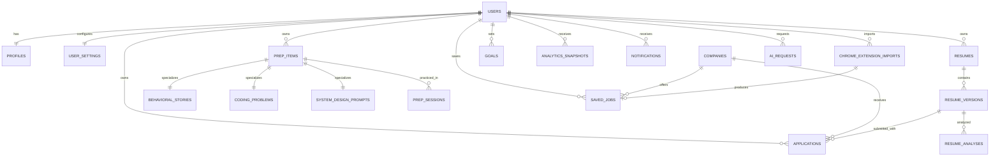

# OfferOS PostgreSQL Data Model

## Design Philosophy

PostgreSQL is the production system of record. The schema favors normalized ownership and referential integrity for product data, with deliberate JSONB use only for external payloads, evolving provider metadata, and immutable analysis artifacts.

Conventions:

- UUID primary keys generated by the application, preferably UUIDv7 for index locality.
- `timestamptz` for every timestamp; all services operate in UTC.
- `created_at` and `updated_at` on mutable rows.
- `deleted_at` for soft-deletable user content.
- Integer `version` on collaboratively or frequently edited resources.
- Lowercase snake_case table and column names.
- Status values validated by application enums plus database check constraints.
- Money stored as integer minor units plus ISO currency code when needed.
- User ownership included directly or derivable through a non-null foreign key.

This document describes tables and constraints; SQL and migrations belong to the backend implementation phase.

## Relationship Overview

## Identity and Preferences

### `users`

Local account anchor synchronized from Clerk.

| Field | Notes |
| --- | --- |
| `id` | Primary key |
| `clerk_user_id` | Required, globally unique external subject |
| `primary_email` | Normalized email for communication; unique only when verified and present |
| `status` | `active`, `suspended`, `deletion_pending`, `deleted` |
| `role` | `user`, `support`, `admin`; default `user` |
| `last_seen_at` | Optional activity timestamp |
| `created_at`, `updated_at`, `deleted_at` | Lifecycle timestamps |

Indexes and constraints:

- Unique index on `clerk_user_id`.
- Partial unique index on normalized `primary_email` where not null and not deleted.
- Index on `(status, created_at)` for operations.

Delete behavior: account deletion is a scheduled workflow. User-owned content is soft-deleted first and hard-deleted after the retention window. Clerk webhook deletion does not immediately cascade physical deletion.

### `profiles`

One-to-one user-facing recruiting profile.

Fields: `user_id` primary/foreign key, display name, school, graduation year, degree, major, preferred roles, preferred locations, work authorization summary, portfolio URL, GitHub URL, LinkedIn URL, timezone, onboarding completion timestamp, timestamps.

Constraints: URLs validated at the service boundary; graduation year bounded; `user_id` unique by being the primary key.

Delete behavior: cascade when the user is physically deleted.

### `user_settings`

One-to-one product preferences.

Fields: `user_id` primary/foreign key, theme, locale, timezone override, week start, default application view, notification email/push flags, quiet-hour start/end, analytics opt-in, AI data consent version/timestamp, `preferences` JSONB for non-critical forward-compatible UI preferences, timestamps.

Critical authorization, billing, consent, or security settings must use typed columns rather than JSONB.

## Companies and Recruiting Pipeline

### `companies`

Canonical shared company records.

Fields: `id`, canonical name, normalized name, website domain, careers URL, logo storage reference, industry, size band, headquarters, verified flag, timestamps, optional `merged_into_company_id` for deduplication.

Constraints and indexes:

- Unique partial index on normalized domain when present.
- Index on normalized name using trigram search.
- Self-reference prevents merging a company into itself.
- Company rows are not deleted when an application is deleted; obsolete duplicates are merged.

### `applications`

User-owned recruiting opportunities.

Fields:

- Identity/ownership: `id`, `user_id`, `company_id`.
- Role: title, location, employment type, role category, source, job URL, external job ID.
- Pipeline: status, priority, applied date, deadline, rejection date, offer date.
- Contacts: recruiter name and email. A separate contacts table can be introduced with the recruiter CRM phase.
- Compensation: salary text initially; later structured minimum/maximum, currency, and period columns.
- Resume: `resume_version_id` nullable foreign key.
- Content: notes, tags through `application_tags`, archived flag.
- Concurrency/lifecycle: `version`, timestamps, `deleted_at`.

Constraints and indexes:

- Index `(user_id, status, updated_at desc)` for pipeline boards.
- Index `(user_id, deadline)` where deadline is not null and row is active.
- Index `(user_id, applied_at)` for trends.
- Index `(company_id, role_title)` for deduplication support.
- Optional unique deduplication key `(user_id, source, external_job_id)` when external ID exists.
- Status/date checks prevent an offer date before applied date and invalid priority/status values.

Delete behavior: soft delete. `company_id` uses restrict; `resume_version_id` uses set null so historical applications survive version removal.

### `application_tags` and `tags`

User-scoped normalized tags. `tags` contains `id`, `user_id`, normalized name, display name, timestamps, unique `(user_id, normalized_name)`. Join table `application_tags` has composite primary key `(application_id, tag_id)` and cascades when the application or tag is physically deleted.

## Resumes

### `resumes`

A logical resume family, such as “Backend Resume” or “Quant Resume.”

Fields: `id`, `user_id`, name, target role, description, status (`active`, `archived`), default version ID nullable, timestamps, `deleted_at`.

Constraints:

- Unique active name per user: partial unique `(user_id, lower(name))` where not deleted.
- `default_version_id` must belong to the same resume; enforce in service logic and a deferred database trigger only if necessary.

### `resume_versions`

Immutable or append-oriented file/content revisions under a resume.

Fields: `id`, `resume_id`, version number, original filename, MIME type, byte size, object storage key, checksum, extraction status, extracted text storage reference or encrypted text, parser version, structured sections JSONB, target role snapshot, notes, created by, timestamps, `deleted_at`.

Constraints and indexes:

- Unique `(resume_id, version_number)`.
- Unique `(resume_id, checksum)` prevents duplicate uploads within a resume.
- Index `(resume_id, created_at desc)`.
- Storage keys are globally unique.

Do not overwrite file metadata or extracted text for a prior version. A new upload creates a new version, preserving analysis reproducibility.

### `resume_analyses`

Structured analysis result tied to an exact resume version and optional target application/job.

Fields: `id`, `user_id`, `resume_version_id`, optional `application_id`/`saved_job_id`, `ai_request_id`, analysis type, schema version, overall score, keyword score, strengths JSONB, weaknesses JSONB, missing keywords JSONB, suggested changes JSONB, status, timestamps.

Constraints:

- Index `(user_id, created_at desc)`.
- Index `(resume_version_id, analysis_type, created_at desc)`.
- One completed result per idempotency/request key.
- Analysis rows are retained when a target job is removed by setting optional target references null; source version deletion is restricted until retention cleanup.

## Prep Model

### `prep_items`

Common supertype for practice content. This avoids an unenforceable polymorphic foreign key from sessions.

Fields: `id`, `user_id`, item type (`coding`, `behavioral`, `system_design`), status, title/summary, source, company context nullable, target date nullable, completed at nullable, `version`, timestamps, `deleted_at`.

Indexes: `(user_id, item_type, status, updated_at desc)` and `(user_id, completed_at desc)`.

Each subtype row shares the same primary key as `prep_items`; exactly one subtype must match `item_type`. The application service creates both rows in one transaction.

### `coding_problems`

Fields: `prep_item_id` primary/foreign key, difficulty, topic, target minutes, problem URL, platform, external problem ID, notes.

Constraints: target minutes positive; optional unique `(user_id-derived, platform, external_problem_id)` is enforced through service deduplication or a denormalized user ID only if query volume justifies it.

### `behavioral_stories`

Fields: `prep_item_id` primary/foreign key, question, category, company context, STAR situation/task/action/result, confidence score, notes.

Constraints: confidence score between 1 and 5. Empty STAR fields are valid for drafts. This entity stores reusable stories and the question they currently answer; future many-to-many question mapping can be added without rewriting the story.

### `system_design_prompts`

Fields: `prep_item_id` primary/foreign key, prompt, scale assumptions, notes. Concepts use normalized `design_concepts` plus join table `system_design_prompt_concepts` with a composite primary key.

### `prep_sessions`

Append-only practice events.

Fields: `id`, `user_id`, `prep_item_id`, started at, completed at, duration seconds, outcome/status, confidence before/after, notes, source (`web`, `mobile_pwa`, `extension`, `import`), timestamps.

Indexes: `(user_id, completed_at desc)`, `(prep_item_id, completed_at desc)`, and `(user_id, source, completed_at)` for analytics.

Delete behavior: sessions soft-delete with the user; item deletion sets `prep_item_id` null only after snapshotting item type/title if historical analytics must survive. Initial implementation may restrict item hard deletion while sessions exist.

### `goals`

Fields: `id`, `user_id`, goal type, period (`weekly`, `monthly`), target count, unit, effective start/end, active flag, timestamps, `deleted_at`.

Constraints: positive target, non-overlapping active periods for the same `(user_id, goal_type, period)` where practical. Current progress is computed from source events; it is not stored as mutable truth.

## Analytics and Notifications

### `analytics_snapshots`

Purposefully denormalized derived records for fast historical dashboards.

Fields: `id`, `user_id`, snapshot date, period type, schema version, application metrics JSONB, conversion metrics JSONB, prep metrics JSONB, resume metrics JSONB, generated at.

Constraints: unique `(user_id, snapshot_date, period_type, schema_version)`. Snapshots can be regenerated and are never the source of truth for CRUD.

### `notifications`

Fields: `id`, `user_id`, event type, channel, title, body, action URL, scheduled at, delivered at, read at, status, deduplication key, provider message ID, failure code, retry count, timestamps.

Indexes: `(user_id, read_at, created_at desc)`, `(status, scheduled_at)`, unique partial deduplication key per user/channel where present.

Notification delivery attempts may use a child `notification_attempts` table for provider response history.

## Saved Jobs and Extension Imports

### `saved_jobs`

Pre-application opportunities captured manually or by extension.

Fields: `id`, `user_id`, `company_id`, source, source URL, external job ID, title, location, description storage/reference, employment type, compensation metadata, posting date, closing date, state (`saved`, `dismissed`, `converted`), converted application ID nullable, timestamps, `deleted_at`.

Constraints/indexes: unique partial `(user_id, source, external_job_id)` and fallback URL fingerprint; `(user_id, state, created_at desc)`.

### `chrome_extension_imports`

Immutable ingestion ledger.

Fields: `id`, `user_id`, extension installation ID, source site, source URL, parser version, idempotency key, raw payload JSONB, payload checksum, status, validation errors JSONB, resulting saved job ID nullable, received/processed timestamps.

Constraints: unique `(user_id, idempotency_key)`, index `(status, received_at)`, and retention policy for raw payloads. Raw HTML should not be retained unless necessary and consented.

## AI Operations

### `ai_requests`

Provider-independent job ledger.

Fields: `id`, `user_id`, feature, status, provider, model, prompt template/version, input references JSONB, redacted input hash, output JSONB, output schema version, token counts, estimated cost, latency, queued/started/completed timestamps, error class/message, idempotency key, retention date.

Constraints/indexes:

- Unique `(user_id, feature, idempotency_key)`.
- `(status, queued_at)` for worker claiming.
- `(user_id, created_at desc)` for usage history.
- No secrets or raw provider credentials in rows.

Large prompts/responses or sensitive extracted text should live encrypted in object storage with short-lived references if database size or privacy requirements warrant it.

## Operational Tables

### `outbox_events`

Fields: ID, aggregate type/ID, user ID, event type/version, payload JSONB, occurred at, available at, published at, attempt count, last error. Index `(published_at, available_at)` for dispatch. Domain writes and outbox inserts share a transaction.

### `audit_events`

Append-only security and support audit log: actor type/ID, user target, action, resource type/ID, request ID, IP hash, user-agent summary, metadata, timestamp. Restrict deletion; apply a defined retention period.

## Cascade and Deletion Rules

| Relationship | Rule |
| --- | --- |
| User to profile/settings | Physical cascade after account retention workflow |
| User to product content | Soft delete first; background hard-delete later |
| Company to applications/saved jobs | Restrict; merge companies instead of deleting referenced rows |
| Resume to versions | Restrict while referenced; retention worker deletes descendants in order |
| Resume version to application | Set null on physical deletion |
| Prep item to subtype | Cascade; subtype cannot exist independently |
| Prep item to sessions | Restrict or archive reference; preserve history |
| Import to saved job | Set null on saved-job deletion; retain ingestion audit temporarily |
| AI request to analysis | Restrict during retention; delete together through privacy workflow |

## Soft Delete Strategy

Soft delete applies to users, applications, resumes, resume versions, prep items, goals, saved jobs, and other user-authored records where accidental recovery or legal retention matters. Default repository queries must exclude `deleted_at is not null`. Unique indexes should be partial so deleted names do not block recreation.

Notifications, sessions, imports, audit events, outbox events, and AI requests are lifecycle/ledger records. They use status and retention policies rather than user-facing soft delete. Privacy deletion workflows must still remove or anonymize personal data.

## Future-Proofing Rules

- Prefer additive migrations and backfills; do not couple deploys to destructive schema changes.
- Version external payloads, analytics snapshots, AI prompts, and AI output schemas.
- Preserve immutable resume versions and source job snapshots for reproducibility.
- Keep provider IDs separate from internal IDs.
- Store user timezone and render local dates at the edge; never persist ambiguous local timestamps.
- Introduce table partitioning only after measured table growth and query plans justify it.
- Use database constraints for invariants that must survive every code path; use services for cross-row workflow policy.
