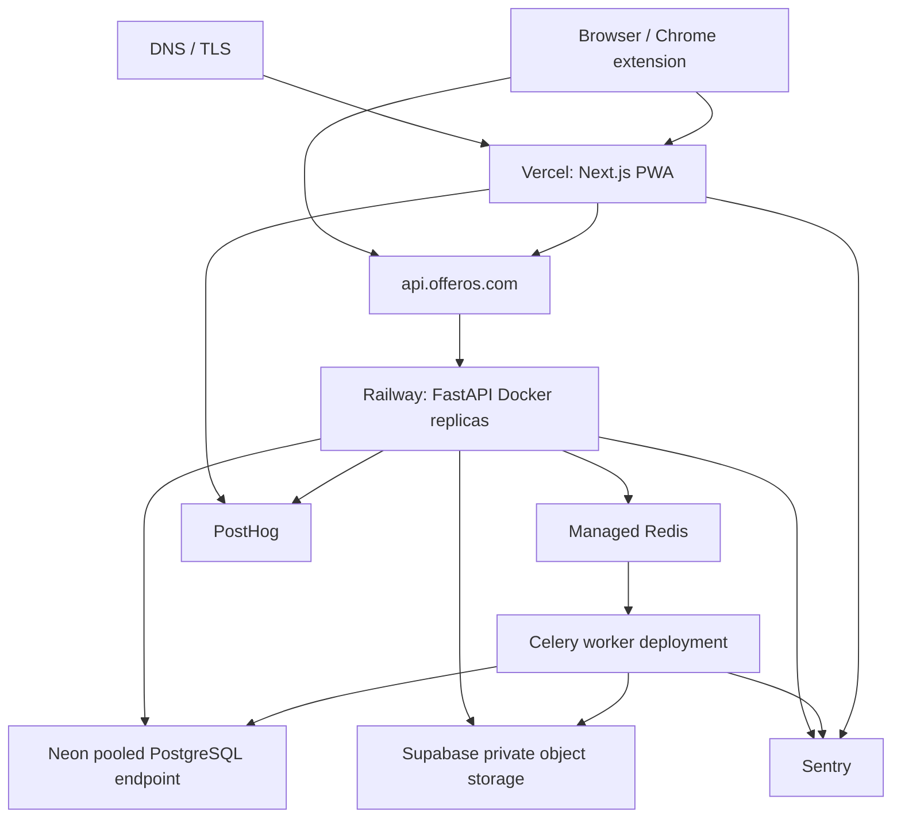

# OfferOS Production Deployment

## Target Topology



## Platform Decisions

### Frontend: Vercel

Vercel is the primary Next.js runtime because it supports App Router builds, preview deployments, CDN assets, managed TLS, and production promotion with minimal custom infrastructure.

Responsibilities:

- Build and deploy `apps/web`.
- Serve static PWA assets and service worker.
- Run any future Next.js server rendering needed for the authenticated shell.
- Configure production and preview domains.
- Apply security headers and cache policy.

The frontend must call FastAPI through a configured public API origin. Next.js should not become a second business-logic backend or proxy every API request without a measured requirement.

### Backend: FastAPI on Railway

Initial recommendation: deploy a Dockerized FastAPI modular monolith on Railway. Railway offers a low-operations path for API and worker services while preserving standard containers and an exit path. Fly.io is a valid alternative if regional placement or private networking becomes a stronger requirement.

Deploy separate process types from the same immutable image:

- `api`: Uvicorn/Gunicorn FastAPI service.
- `worker-default`: Celery general tasks.
- `worker-ai`: future AI/extraction tasks with separate concurrency and budgets.
- `scheduler`: one Celery Beat or equivalent scheduler instance when scheduled work begins.

Do not run migrations or schedulers in every API replica.

### Database: Neon PostgreSQL

- Use one Neon project per environment boundary where practical.
- API traffic uses Neon's pooled connection endpoint.
- Migrations and administrative jobs use the direct endpoint.
- Bound SQLAlchemy pool sizes so aggregate replicas cannot exhaust database connections.
- Enable point-in-time recovery and define a tested restoration runbook.
- Use Neon branches for short-lived migration testing only when cost and workflow justify it; they are not a replacement for staging acceptance tests.

### Resume Storage: Supabase Storage

Preferred initial choice: private Supabase Storage buckets because OfferOS needs private documents and signed upload/download URLs more than image transformation. Cloudinary remains appropriate if resume preview rendering later depends heavily on transformation pipelines.

Rules:

- Bucket is private; no public resume URLs.
- Objects are namespaced by environment and internal user ID.
- Clients upload only through short-lived signed intents issued after authorization.
- Backend verifies object metadata before finalizing a resume version.
- Downloads use short-lived signed URLs and generate audit events for unusual access.
- Malware scanning and extraction run asynchronously before a file becomes analysis-ready.

PostgreSQL stores object keys, checksums, size, and MIME metadata, never raw file bytes.

### Queue and Workers: Redis + Celery

Redis and Celery are deferred until the first asynchronous feature (resume extraction, notifications, or AI) ships. Before that, the outbox table can exist without a running broker.

- Use managed Redis with TLS and authentication.
- Separate queues by workload and latency: `default`, `imports`, `notifications`, `extraction`, `ai`.
- Configure time limits, acknowledgement-after-completion, bounded prefetch, and dead-letter handling.
- Workers are idempotent and keyed by durable request/event IDs.
- Queue messages contain IDs, not full resumes or sensitive prompt bodies.

## Environments

| Environment | Purpose | Data policy |
| --- | --- | --- |
| Local | Developer workflow | Synthetic/demo data only |
| Preview | Per-PR frontend and optional shared API | No production data; restricted integrations |
| Staging | Release candidate and migration validation | Synthetic or sanitized fixtures |
| Production | User traffic | Full controls, backups, monitoring |

Environment credentials, Clerk instances, storage buckets/prefixes, Sentry projects, and PostHog keys must be isolated. Production services must reject staging Clerk issuers and storage references.

## Container and Runtime Configuration

The future backend image should:

- Use a pinned supported Python version and lock dependencies.
- Build in a multi-stage Dockerfile.
- Run as a non-root user with a read-only filesystem where practical.
- Include only runtime packages in the final image.
- Expose a single HTTP port and use platform termination signals.
- Emit structured logs to stdout.
- Include image labels for commit SHA, build time, and version.
- Be scanned for known vulnerabilities in CI.

API startup must not run schema migrations. The readiness endpoint remains false until required dependencies are reachable, but liveness does not fail for a transient database outage.

## CI/CD Pipeline

GitHub Actions is the source-of-truth pipeline.

```mermaid
flowchart LR
    PR["Pull request"] --> Checks["Lint, typecheck, tests"]
    Checks --> Build["Web build + API image build"]
    Build --> Preview["Vercel preview / staging image"]
    Preview --> Contract["Contract and smoke tests"]
    Contract --> Merge["Merge to main"]
    Merge --> Migrate["Reviewed forward migration"]
    Migrate --> DeployAPI["Deploy API/workers"]
    DeployAPI --> DeployWeb["Promote web"]
    DeployWeb --> Smoke["Production smoke checks"]
```



### Pull Request Checks

- Frontend lint, TypeScript, unit tests, and `next build`.
- Backend formatting, static typing, unit tests, PostgreSQL integration tests, and OpenAPI compatibility check.
- Migration safety review and upgrade/downgrade test against an ephemeral database.
- Docker build and vulnerability scan.
- Secret scan and dependency audit.
- Critical browser workflow tests on preview/staging.

### Release Sequence

1. Build immutable frontend and backend artifacts tagged with commit SHA.
2. Apply backward-compatible database migrations through a one-off migration job.
3. Deploy API and workers; verify readiness and error rate.
4. Promote frontend referencing the compatible `/api/v1` contract.
5. Run authenticated smoke tests.
6. Monitor error rate, latency, queue age, and database load.

Schema changes use expand/migrate/contract:

1. Add new nullable column/table/index.
2. Deploy code supporting old and new forms.
3. Backfill in bounded batches.
4. Enforce new constraint.
5. Remove old code/column in a later release.

Rollback means redeploying the previous application image. Destructive database rollback is avoided; migrations must remain compatible with the previous release during the deployment window.

## Environment Variables

### Next.js/Vercel

```text
NEXT_PUBLIC_APP_URL
NEXT_PUBLIC_API_BASE_URL
NEXT_PUBLIC_CLERK_PUBLISHABLE_KEY
CLERK_SECRET_KEY
NEXT_PUBLIC_POSTHOG_KEY
NEXT_PUBLIC_POSTHOG_HOST
SENTRY_AUTH_TOKEN                 # build only
NEXT_PUBLIC_SENTRY_DSN
```

### FastAPI

```text
APP_ENV
APP_VERSION
LOG_LEVEL
DATABASE_URL                      # pooled runtime endpoint
DATABASE_MIGRATION_URL            # direct endpoint, migration job only
CLERK_ISSUER
CLERK_AUDIENCE
CLERK_JWKS_URL
CLERK_WEBHOOK_SECRET
CORS_ALLOWED_ORIGINS
SUPABASE_URL
SUPABASE_SERVICE_ROLE_KEY
SUPABASE_RESUME_BUCKET
REDIS_URL                         # only when queues/rate limits ship
SENTRY_DSN
POSTHOG_API_KEY
POSTHOG_HOST
```

Future provider secrets are feature-scoped: AI gateway key, email provider key, calendar OAuth credentials, and extension signing values. Worker-only secrets should not be present in the API or frontend runtime when avoidable.

## Secrets Management

- Store secrets in Vercel and Railway/Fly environment secret stores, never in Git or Docker images.
- Use separate values per environment and least-privilege service accounts.
- Limit production secret access to production deployers and services.
- Rotate webhook, storage, database, and AI credentials on a documented schedule and after suspected exposure.
- Prefer short-lived credentials/OIDC for CI where providers support it.
- Redact secrets from logs, Sentry breadcrumbs, build output, and support tools.
- Maintain an emergency rotation and revocation runbook.

## Production Configuration

### Networking and HTTP

- TLS-only with HSTS after domain validation.
- Explicit CORS allowlist.
- Trusted proxy configuration for client IP and scheme.
- Request body limits globally and tighter upload/import limits by endpoint.
- API timeouts below platform hard limits; long work returns `202`.
- Compression for safe JSON responses; no compression of secrets in reflected contexts.
- Security headers on Vercel: CSP, frame ancestors, referrer policy, permissions policy, and MIME sniffing protection.

### Database

- Statement timeout and idle transaction timeout.
- Slow query logging and query-plan review.
- Connection pool budget per replica/process.
- Read/write transactions use explicit scope; no global session.
- Online/concurrent index creation for large production tables.
- Automated backups plus quarterly restore exercises.

### Object Storage

- Private bucket, server-side encryption, lifecycle cleanup for abandoned upload intents.
- Maximum size and accepted MIME allowlist.
- Checksums and malware scan status before extraction.
- Retention cleanup tied to account deletion and resume version lifecycle.

## Monitoring and Product Analytics

### Sentry

Use Sentry for frontend, API, and worker errors and distributed traces. Attach environment, release SHA, request ID, route, and job type. Do not attach resume text, STAR stories, authorization headers, or full provider prompts.

Alert initially on:

- Elevated 5xx rate or p95 API latency.
- Authentication/JWKS failures.
- Database connection saturation.
- Worker queue age and terminal failures.
- Resume upload/extraction failure rate.
- AI spend or error anomalies.

### PostHog

Use PostHog for consent-aware product analytics and feature flags. Track semantic events such as application created, status changed, prep session completed, and resume analysis requested. Avoid raw job descriptions, resumes, notes, emails, and recruiter names.

Server-side events use the internal user ID. Identity linkage to Clerk must be deliberate and documented. Respect opt-out and deletion requests.

### Clarity

Microsoft Clarity may be used only after privacy review. Sensitive inputs and authenticated recruiting content must be masked, and session recording should be disabled on resume/STAR story surfaces if reliable masking cannot be guaranteed. Clarity is optional; Sentry and PostHog are the production baseline.

## Reliability, Scaling, and Cost Controls

- Start with one API service and no workers until asynchronous features ship.
- Autoscale stateless API replicas based on CPU/latency while respecting database connection budget.
- Scale workers by queue depth and oldest-job age, with hard concurrency limits for AI.
- Cache public/static assets at Vercel; do not cache private API responses at shared edges.
- Apply per-user AI quotas and global daily spend caps.
- Use retention policies for imports, AI payloads, analytics snapshots, and logs.
- Review Neon, storage, Redis, Sentry, and PostHog usage monthly.

## Disaster Recovery

Define and test:

- Target RPO: initially 24 hours minimum, improved to provider PITR capability before public production.
- Target RTO: initially four hours for the modular monolith.
- Database point-in-time restoration to an isolated project before production cutover.
- Object inventory/checksum reconciliation after database restore.
- Replaying unpublished outbox events safely.
- Clerk and storage credential rotation.
- Status communication and incident ownership.

## Launch Checklist

- Production domains and TLS validated.
- Clerk issuer/audience and redirect allowlists locked.
- CORS allowlist contains no wildcard.
- Database migrations rehearsed on staging-scale data.
- Backup restore completed successfully.
- Storage bucket private; signed URL expiry tested.
- Sentry alerts and release tracking active.
- PostHog privacy review and opt-out implemented.
- Rate limits and request size limits enabled.
- Account export/deletion and incident runbooks reviewed.
- Critical authenticated smoke test passes after deployment.
